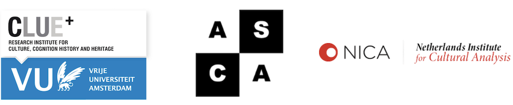

## “Drawing Yourself In and Out of It”  
## The 2nd International Amsterdam Comics Conference

### Vrije Universiteit Amsterdam  
### 15-17 November 2018

Amsterdam Comics is pleased to announce its 2nd international conference, “Drawing Yourself In and Out of It,” which will take place from 15-17 November 2018 at [Vrije Universiteit Amsterdam](http://www.vu.nl), Netherlands.

Comprised of parallel panel sessions, keynote lectures, and a roundtable discussion, the conference aims to encourage interdisciplinary connections between comics scholars from various disciplines, comics artists, publishers, and cultural workers from museums and other heritage sites. 

### **Keynote Speakers**

[Joe Sacco](http://www.fantagraphics.com/artists/joe-sacco/), comics artist  
[Nina Mickwitz](http://www.arts.ac.uk/research/ual-staff-researchers/a-z/dr-nina-mickwitz/), University of the Arts London

 

<h4>“So, where does a story begin? And if you are inside that story right now, in that situation and it hurts and say you can draw, then you must try and draw yourself out of it.”</h4>

<h5>-Miriam Katin, <i>Letting It Go</i></h5>

To draw in can suggest an attraction, engagement, or involvement with an object, narrative, or cause, or can point to literally drawing someone or something into a work of art. To draw out can suggest an enticement to speak or act, a revelation of things hidden, or an extension of time, but can also be a literal or figural removal of one thing from another. Thus, drawing in and out speak to an engrossment in and an examination of a politics of affect.

“Drawing Yourself In and Out of It” seeks to explore the notions of drawing in and drawing out in terms of the capacity to affect and to be affected. Such a consideration allows us to interrelate the politics of affect with the reading and production of comics in a variety of genres—including biography, autobiography, memoir, and fiction, and fields—including journalism, history, and the Medical Humanities. With this conference we aim to encourage an interdisciplinary dialogue from which to further engage with and reflect upon the power of this culturally shifting medium.

The conference encourages papers exploring the notions of drawing in and/or out in relation to, for example: 

* Graphic Medicine
* Art/Narrative Therapy
* Journalism
* (Micro)Politics and/or Art as Activism
* Individual or Collective Memory and/or Trauma
* Gender and/or Sexuality Studies
* Genre Considerations (Biography, Autobiography, Memoir, Fiction, etc.) 
* Style (Abstract, Clear Line, Photorealism, etc.)
* Poetics and/of/in the Medium of Comics
* Comics Production Processes

### **Abstract Submissions (-closed-)**

For a pdf version of this call for papers, please find it <a href="CFP_Amsterdam_Comics_Conference_Fall_2018.pdf">here.</a>

### **Conference Fees**

Registration is €75 for full-time/tenured professionals and €50 for students/artists, which includes all conference events. The keynote lectures and roundtable are open to the public. Registration for each event is €5.  

### **Organizing Committee**

Erin La Cour, Rik Spanjers, Freija Camps, Nick Burman (intern), and Doğa Tekneci (intern). Should you have any questions, please contact us at info{at}amsterdamcomics.com.

### **Partner**

[CLUE+ Research Institute for Culture, Cognition, History and Heritage](https://clue.vu.nl/en/index.aspx), Vrije Universiteit Amsterdam; [The Netherlands Institute for Cultural Analysis (NICA)](https://www.nica-institute.com); and [The Amsterdam School for Cultural Analysis (ASCA)](http://asca.uva.nl).

 

