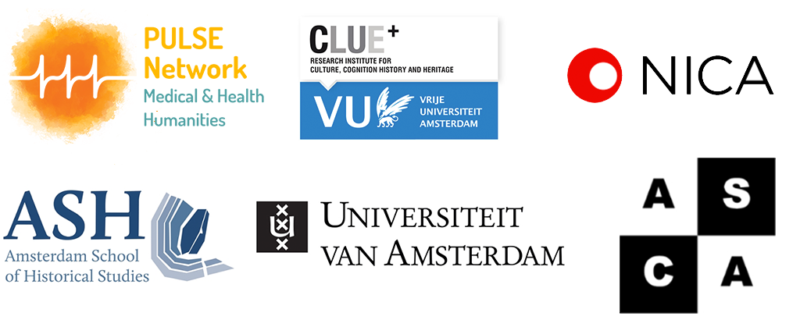

Amsterdam Comics is pleased to announce its 3rd international conference, “Isolation, Arts, Engagement,” hosted in collaboration with [PULSE](http://www.pulsenetwork.nl): Centre for the Medical and Health Humanities of the [CLUE+](https://vu.nl/en/about-vu/research-institutes/clue) Interfaculty Research Institute for Culture, Cognition, History, and Heritage at the Vrije Universiteit Amsterdam.

Comprised of parallel panel sessions, keynote lectures, and a book launch event, the conference aims to encourage interdisciplinary connections between comics scholars, those working within the broad field of the Medical and Health Humanities, artists, practitioners, cultural workers, activists, and educators.

### **Keynote Speakers**

[Esther Appleyard-Fox](https://appleyardfoxart.com/about), [Accentuate](https://screensouth.org/accentuate/)  
[Dr. John Miers, Kingston School of Art ](https://johnmiers.com)  
[Dr. Anna Poletti, Utrecht University](https://www.uu.nl/medewerkers/ALPoletti) 

 

<h4><i>Crip time is time travel. Disability and illness have the power to extract us from linear, progressive time with its normative life stages and cast us into a wormhole of backward and forward acceleration, jerky stops and starts, tedious intervals and abrupt endings.</i></h4>

<h5>Ellen Samuels 2017</h5>

Whether outside of or coupled with personal circumstance, collectively we’ve all had to rethink time, illness, and disability in our being forced into—or perhaps having happily entered—periods of isolation in order to keep ourselves safe and help prevent the further spread of Covid-19. 

With education moving online, cultural institutions shuttering, and borders closing, the effects of the pandemic have required us “to break in our bodies and minds to new rhythms, new patterns of thinking and feeling and moving through the world” (Samuels 2017). This has especially come to the fore with the increase in reported cases of mental health issues ranging from profound loneliness to depression and anxiety, which, for those with pre-existing medical conditions has been compounded by delays or cancellations in treatment due to overburdened healthcare facilities. 
But what else has isolation provoked in us, both personally and interpersonally? What new forms of communication, communities, and insights have we developed from having to slow down and stay put? Has forced isolation impacted how and why we read and/or produce various art forms and/or scholarship? What have our experiences taught us about relationality, care, empathy, practice, representation, access, and education? How have museums and other cultural institutions provided comfort or critique? 

In this conference, we aim to explore these issues from a variety of perspectives, and therefore invite papers and/or artistic work that examines isolation, arts, and engagement through lenses such as:

* The Poetics and/or Aesthetics of Graphic Medicine and/or Other Narrative Forms 
* (Activist) Art Practices, Production, and/or Audiences
* (Activist) Cultural Work, Programming, and/or Curation
* Practice-Based Pedagogy and/or Object-Based Learning
* Art and/or Narrative Therapy
* Forms of Mediation and/or Communication and Community
* Individual and/or Collective Memory and/or Trauma
* Gender, Sexuality, Class, Race, Ethnicity, Language, and/or Intersectionality
* Boredom, Affect, and/or Disability Studies

### **Abstract Submissions**

Applicants to the conference are invited to submit a 300 word abstract and short biographical note to the organizers at info{at}amsterdamcomics.com by 15 July 2022. Accepted participants will receive confirmation no later than 1 August 2022.

For a pdf version of this call for papers, please find it <a href="CFP-Isolation-Arts-Engagement-Amsterdam-Comics-Conference-2022.pdf">here.</a>

### **Conference Fees**

Registration is €75 for full-time/tenured professionals and €50 for students/artists/part-time professionals, and includes coffee/tea breaks, bagged lunch, and all conference events. 

RMA and PhDs who are members of one of The Netherlands’ national research schools may apply to attend the conference for free and obtain 2 ECTS via [The Netherlands Institute for Cultural Analysis (NICA)](https://www.nica-institute.com). The conditions for obtaining credits are: attendance at all conference events (28 hours/1 ECTS), reading assigned preparatory texts (14 hours/,5 ECTS), and writing a 1000 word response paper to one of the keynote lectures (14 hours/,5 ECTS). Because space is limited, preference will be given to NICA affiliated RMAs/PhDs. To register, please send an email to the organizers at info{at}amsterdamcomics.com noting (where applicable) your programme, university, and consent to share with NICA your contact details to receive credits. 

### **Organizing Committee**

[Erin La Cour](https://research.vu.nl/en/persons/erin-la-cour) (Vrije Universiteit Amsterdam)  
[Manon Parry](https://research.vu.nl/en/persons/manon-parry) (Vrije Universiteit Amsterdam and University of Amsterdam)  
[Rik Spanjers](https://www.uva.nl/en/profile/s/p/r.spanjers/r.spanjers.html) (University of Amsterdam)  

### **Partners**

[CLUE+ Research Institute for Culture, Cognition, History and Heritage](https://clue.vu.nl/en/index.aspx), Vrije Universiteit Amsterdam; [PULSE: Centre for the Medical and Health Humanities](http://www.pulsenetwork.nl); [The Netherlands Institute for Cultural Analysis (NICA)](https://www.nica-institute.com); [The Amsterdam School for Cultural Analysis, University of Amsterdam (ASCA)](http://asca.uva.nl); and the [Amsterdam School of Historical Studies, University of Amsterdam](https://ash.uva.nl)

 

