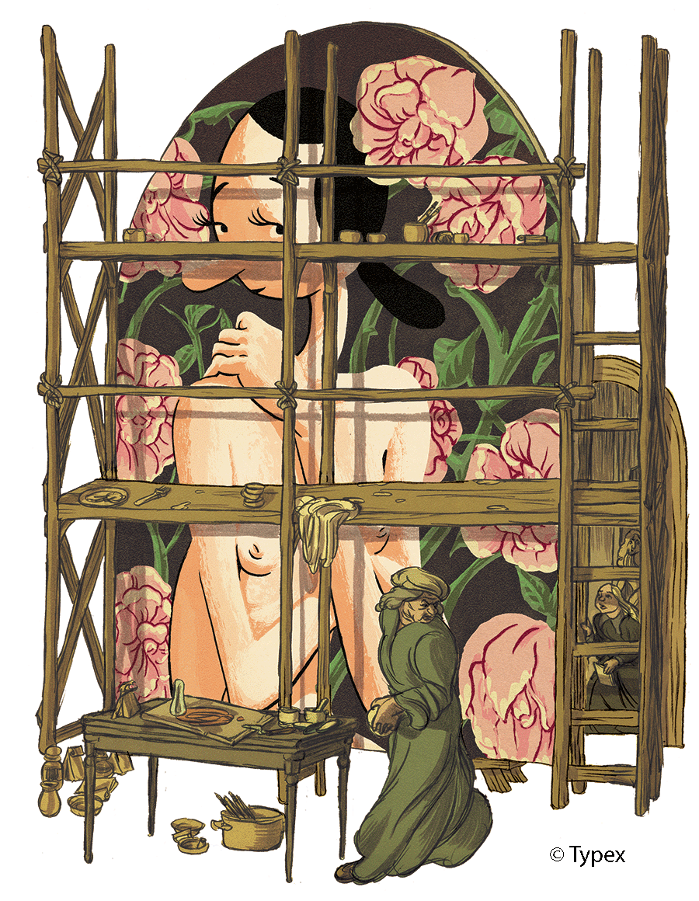
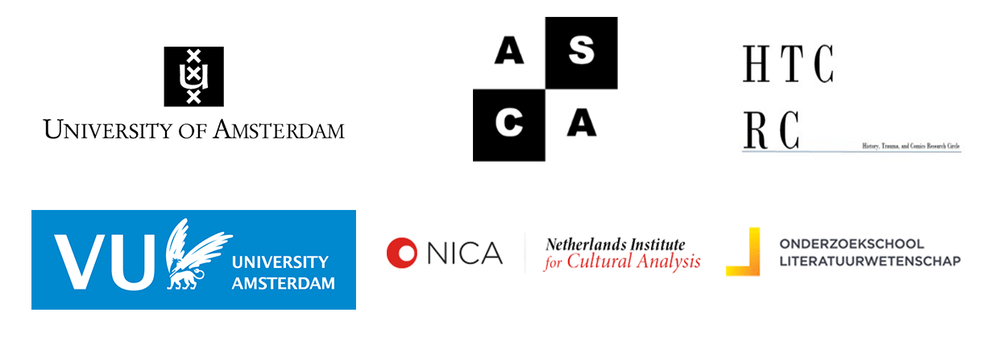

## Amsterdam Comics Conference

## "Comics Interaction"

### 1-3 July 2015

**Amsterdam Comics** is pleased to announce our inaugural international conference, **“Comics Interaction,”** which will take place from 1-3 July in Amsterdam, Netherlands.

Comprised of three days of parallel panel sessions, round table discussions, and public keynote lectures, the conference aims to encourage interdisciplinary connections between comics scholars from various disciplines, comics artists, publishers, and cultural workers from museums and other heritage sites. The conference will focus on three themes of comics interaction: **Comics in Art, Art in Comics**; **History and Trauma in Comics**; and **Comics as World Literature.** The conference will be hosted at the University of Amsterdam and several local cultural institutions.

### **Keynote Speakers**

[Prof. Dr. Jan Baetens](http://www.kuleuven.be/wieiswie/en/person/00004749), University of Leuven, Belgium  
[Prof. Dr. Bart Beaty](https://english.ucalgary.ca/profiles/bart-beaty), University of Calgary, Canada  
[Dr. Joyce Goggin](http://www.uva.nl/over-de-uva/organisatie/medewerkers/content/g/o/j.goggin/j.goggin.html), University of Amsterdam, Netherlands  

### **Special Guest Presentations**

Mara Joustra and [Eva Hilhorst](http://evahilhorst.blogspot.nl), “Comics Journalism”  
[Jitse Verwer](http://www.abc.nl), “Comics at the American Book Center”  
[Typex](http://typex.nl), “Comics vs. Culture”

### **Round Table Panelists**

[Dr. Pascal Lefèvre](http://www.luca-arts.be/campus/sint-lukas-brussel), LUCA School of Arts, campus Sint-Lukas Brussel, Belgium  
Lies Schippers, co-author _The Search_,  [Anne Frank Foundation](http://www.annefrank.org/en/)  
[Joost Pollmann](http://joostpollmann.nl), Director of Comedium  
[Dr. Anik Fournier]( http://dutchartinstitute.eu/page/3395/anik-fournier), ArtEz, Arnhem, Netherlands  
[Prof. Dr. Christa Maria Lerm-Hayes](http://www.uva.nl/over-de-uva/organisatie/medewerkers/content/l/e/c.m.k.e.lerm-hayes/c.m.k.e.lerm-hayes.html), University of Amsterdam, Netherlands  
[Dr. Joost de Bloois](http://www.uva.nl/over-de-uva/organisatie/medewerkers/content/b/l/j.g.c.debloois/j.g.c.de-bloois.html), University of Amsterdam, Netherlands  
[Dr. Stephan Besser](http://www.uva.nl/over-de-uva/organisatie/medewerkers/content/b/e/s.besser/s.besser.html), University of Amsterdam, Netherlands  
[Dr. Ernst van den Hemel](http://www.uu.nl/medewerkers/EvandenHemel/0), Utrecht University, Netherlands  
[Daan Hassler-Forest](http://www.uva.nl/over-de-uva/organisatie/medewerkers/content/h/a/d.a.hassler-forest/d.a.hassler-forest.html), University of Amsterdam, Netherlands  
[Eric Heuvel](http://www.eric-heuvel.nl), Comics Artist  
[Marcel Ruijters](http://troglo.home.xs4all.nl), Comics Artist  
[Joost Swarte](http://www.joostswarte.com), Comics Artist  

### **Three Themes**

**1- Comics in Art, Art in Comics**

The question of the place of comics within the system of the arts is an ongoing—and multifaceted—debate. As comics slowly enters academic and art discourse through the side doors of the university and the museum, the questions of whether comics is part of “the culture industry” or if it is indeed the “ninth art” have given way to questions of hierarchy within the form itself. These questions, which include delineations of “high” and “low,” genre distinctions, and when and how to (re)present comics in exhibitions, however, often signal a return to the initial problematic: does comics belong in the category of arts—and, if so, where? The conference invites papers that investigate, for example: the art of comics; the medium and/or form of comics; “high” vs. “low” culture / mass market vs. art; comics in the museum; and art’s (ab)use of comics and vice versa.

**2- History and Trauma in Comics**

The publication of Art Spiegelman’s Maus gave new direction to the discussions concerning the propensity of the comic book medium to represent historic and traumatic events. It would be a mistake, however, to see Maus as the genesis of historical and traumatic narratives in comic book form. Since the early beginnings of the medium, comics have dealt with the historic and traumatic in a wide variety of ways and for very different purposes. Historical comic books entertain, educate, wound, and heal. The conference invites papers that investigate the ways, purposes, and discursive environments in which comics deal with issues of memory, history, and trauma. Topics include, for example: (auto)biography & memoir; repetition; testimony; remembering; forgetting; comics in relation to other modes of historiography; the impact of comics on the dynamics of national, regional, and international remembrance; and comics and/as therapy.  

**3- Comics as World Literature**

The concept of “world literature” no longer focuses on the worldwide circulation of (Western) canonical works, but is currently employed to study literature as a global and intercultural phenomenon. Similarly, comics scholarship is presently shifting from its traditional emphasis on specific national and/or European contexts to a focus on the interaction between different comics traditions and the ways in which comics travel the world, including the various linguistic, legal and cultural boundaries that they encounter in this process. However, this does not make questions concerning the cultural and national specificity of comics superfluous. The conference therefore invites papers that explore the possibilities of tensions of reading comics as a form of “world literature,” including, for example: the international reception of comics; manga (around the world); comics and (possibilities of) translation; and comics and/as literature.

### **Application**

Applicants to the conference are invited to submit a 250 word abstract, short biographical note, and indication of
theme preference by 17 April 2015 to the organizers, drs. Rik Spanjers and Dr. Erin La Cour, at
info{at}amsterdamcomics.com.

For a .pdf version of the call for papers, please find it <a href="img/CFP-Comics.Interaction.2015.pdf">here.</a>

### **Amsterdam Comics would like to thank**

[The University of Amsterdam](http://www.uva.nl/en/home), 
[VU University Amsterdam](http://www.vu.nl/nl/index.asp), 
the [Amsterdam School for Cultural Analysis (ASCA)](http://asca.uva.nl), 
the [Amsterdam School for Culture and History (ASCH)](http://asch.uva.nl), 
the [Netherlands Research School for Literary Studies (OSL)](http://www.oslit.nl), 
the [Netherlands Institute for Cultural Analysis (NICA)](http://www.nica-institute.com), 
the [Department of Literature and Society (VU)](http://en.literatuurensamenleving.nl),
the [English Department (UvA)]((http://www.uva.nl/en/disciplines/english)) and the [Dutch Studies Department (UvA)](http://www.uva.nl/en/disciplines/dutch), 
[History, Trauma & Comics Research Circle](https://historytraumacomics.wordpress.com/2014/07/23/sixth-meeting-to-seize-the-fright-panels-gaps-animal-headed-characters-in-trauma-related-graphic-novels/),
[Lambiek](https://www.lambiek.net), and the 
[Netherlands Institute for War, Holocaust and Genocide Studies](http://niod.nl/en)
for their generous support of the conference.

