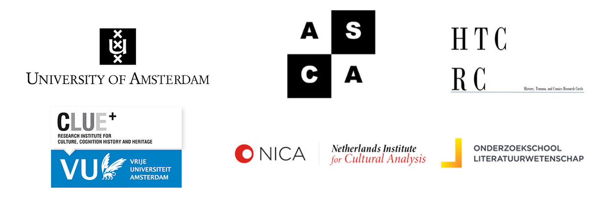

----

Founded in 2014, Amsterdam Comics is an independent research consortium that seeks to productively clash theory with practice through several strategies - both academic and public. Following from our inaugural international conference in the summer of 2015, we founded a monthly reading group and will host a guest lecture series and master class through the Netherlands Research School for Literary Studies in April 2016. We have also  guest edited an issue of _[Image [&] Narrative](http://www.imageandnarrative.be/index.php/imagenarrative/issue/view/79)_ (October 2016), and are in the early planning stages of an experimental comics exhibition. If you are interested in joining us, please contact us at info@amsterdamcomics.com.

----

