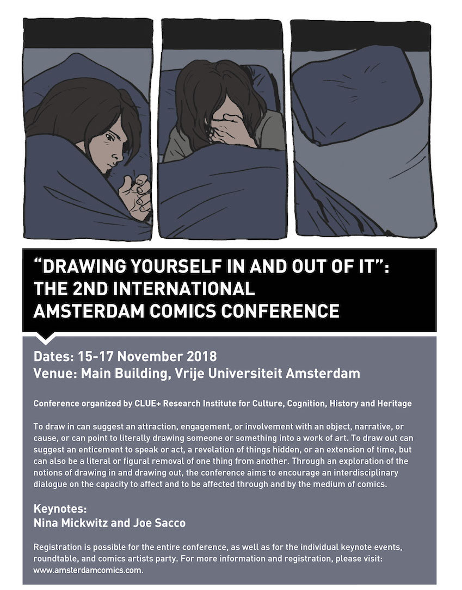

----

Founded in 2014, Amsterdam Comics is an independent research consortium that seeks to productively clash theory with practice through several strategies—both academic and public. Following from our inaugural international conference in the summer of 2015, we founded a bi-annual guest lecture and master class series and a comics theory reading group. We also recently guest edited an issue of [Image [&] Narrative](http://www.imageandnarrative.be/index.php/imagenarrative/issue/view/79) (October 2016), and are in the early planning stages our second international conference and an experimental comics exhibition. If you are interested in joining us, please contact us at info{at}amsterdamcomics.com

----

