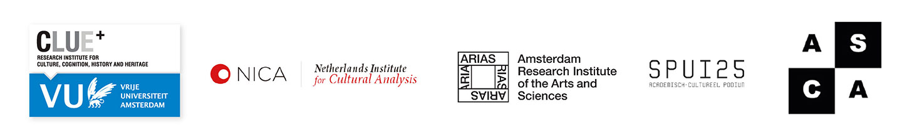

----

Founded in 2014, Amsterdam Comics is an independent research consortium that seeks to productively clash theory with practice through several strategies—both academic and public. Following from our inaugural international conference in the summer of 2015, we founded a guest lecture and master class series and a comics theory reading group. We also guest edited an issue of [_Image [&] Narrative_](http://www.imageandnarrative.be/index.php/imagenarrative/issue/view/79) (October 2016), hosted our second international conference in 2018, and are in the final stages of production on _Key Terms in Comics Studies_, we co-edited with Simon Grennan, which will be published later this year. If you are interested in joining us, please contact us at info{at}amsterdamcomics.com

----

