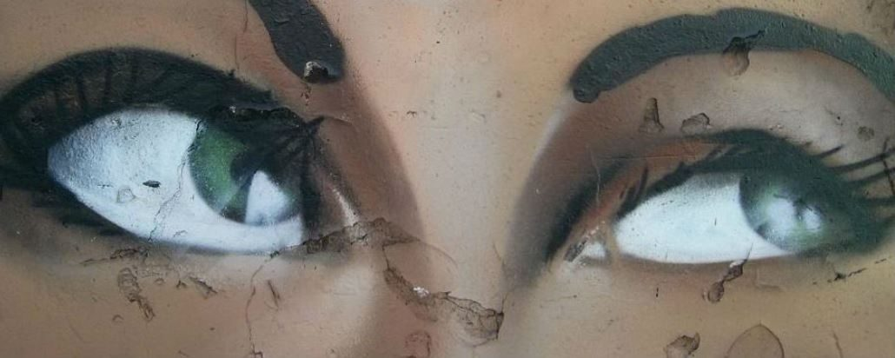

## Exposing Comics: Comics, Canonicity, and the Museum

__Master Classes & Lectures by Prof. Laurence Grove (University of Glasgow) & Dr Ian Horton (University of the Arts London)__

__Date:__ 21 October 2016, 11:00-17:30   
__Location:__ OMHP E2.12A, Oudemanhuispoort 4-6, Amsterdam  
__Master class open to:__ PhD Candidates and RMa Students. RMa Students will receive 1 EC for attending the full day and preparing an object of inquiry for the master class.  
__Registration__: [Research School for Media Studies' registration page](http://www.rmes.nl/v02/events/masterclass-exploring-comics/) 

Over the past few decades, comics have begun to come out of their pop-cultural isolation, finding their way into museums, university courses, auction houses, and a wide range of other cultural institutions. During the two lectures and master class, students will explore the ways in which this newfound sociability of comics impacts considerations of the medium. In the first lecture of the day, Prof. Dr. Laurence Grove from the University of Glasgow will examine the by now widespread practice of exhibiting comics, asking “In what ways do comics travel (in)to museums and what does a ‘good’ comics exhibition look like?” Next, Dr. Ian Horton from the University of the Arts in London will lecture on the ways in which our readings of so-called graphic novels change when we look at them not as book-length works but rather in light of their original publication in a series. Taking into consideration archives of comics works, he examines the difficulties in exhibiting the materiality of comics. Taken together, the lectures will prompt students to consider the medium of comics both within and outside of common conceptions of the ways in which comics are produced, read, and exhibited. For more detailed descriptions of the lectures, please see the descriptions below.

During the master class, which will take place after a lunch break in the afternoon, a select group of RMA and PhD students will experiment with comics exhibitions by creating “paper exhibitions” under the guidance of Prof. Dr. Grove and Dr. Horton. The goal of the master class is to familiarize students with the challenges and rewards of comics exhibitions by way of a practical exercise. By building on considerations from the lectures and through mapping their own exhibitions on paper, students will come face to face with the decisions that impact a medium when it travels from its originary context to other milieux. Select students from the master class will be invited to participate in the experimental comics exhibition of Amsterdam Comics, which will take place during the forthcoming second annual conference of Amsterdam Comics in the fall of 2017.

#### _Program:_

Public Lecture 1: 11.00-12.00

__Why Do Comics Exhibitions… And If So How?__  
__Prof. Laurence Grove, University of Glasgow__

In the not-too-distant past exhibitions allowed the public to see works of art which would not normally be accessible, displaying unique and precious artefacts otherwise hidden under lock and key, or uniting masterpieces from far-flung and hard-to-get-to collections. Comics were rarely classed as art, and so until the 1960s were not to be venerated in august expositions. And now that they are deemed worthy of display, Superman’s full first appearance in _Action Comics_ is only a few Google clicks away.

Why then should we still mount exhibitions or, specifically, put comics on show? Initially, as Walter Benjamin knew, there is always the allure of the authentic object whose presence crosses time and space. But within the world of comics there are further possibilities that allow us to create interactive, three-dimensional experiences that play on the visitor as intuitive component part.

This lecture will consider such issues, before assessing previous comics-related displays, including the Hunterian’s _Comic Invention_, Glasgow, 2016. In short, a 21st-century exhibition, like a lecture, needs to do something that a stay-at-home laptop cannot: we will see how the inherent nature of comics makes this possible.

Coffee and Tea break: 12.00-12.15

Public Lecture 2: 12.15-13.15

__Materiality, Production, and Reception: Re-reading Maus and Palestine__
__Dr. Ian Horton, University of the Arts London__

Art Spiegelman’s _Maus_ and Joe Sacco’s _Palestine_ have received a great deal of academic attention and widespread public acclaim because of the serious subject-matter they explore, respectively the Holocaust and conflict in the Middle East, and the accessible cartoon language employed. However, both works are mainly known and discussed through their publication in collected “graphic novel” form, which this paper seeks to redress this by examining their original publication in serialized comic book form. By looking at the comic books themselves, rather than the repackaged graphic novels, a range of other factors can be highlighted. These include the material aspects, such as paper stock and size of publication; the contextual information, such as advertisements and editorials; and the original audience reception of the works through letter pages, which are important for many serialized comic books.

Access to the original comic books was central to this research and was made possible through The Les Coleman Collection, held in the University Archives and Special Collections Centre at the University of the Arts London. The collection contains a wide range of underground and alternative comic books with a particular focus on works by Robert Crumb, Julie Doucet, and Aleksandar Zograf.

In conclusion this paper will examine the difficulties presented in archiving the anthology-based underground and alternative comic books in the collection and some issues concerning materiality and presentation in organizing an exhibition based on the collection that will open in March 2017.

Lunch breach: 13.15-14.00

Masterclass: 14.00-17.00

#### _Preparation and readings:_

Participants in the master class must read and be prepared to discuss the following texts, which will be made available upon registration:

1. “The Imaginary Museum” by Andre Malraux p 13-16
2. “What if Comics Were Art? Defining a Comics Art World” by Bart Beaty
3. “Social Abstraction: Toward Exhibiting Comics as Comics” by Erin La Cour
4. “An Artist, a Cowboy, and Some Ontological Jokes: A Nordic Contribution to the Understanding of Comics in Art” by Fred Andersson

#### _Credits & certificate:_

Certificates of participation and credits are available upon request after the event. Event coordinators will decide whether the participant has fulfilled all requirements for the ECTS. Please direct your request to RMeS-fgw@uav.nl and include the postal address you want the certificate send to. Note: the certificate itself is not valid as ECTS, you need to validate it yourself at your local Graduate School.

#### Biographies:

[Laurence Grove is Professor of French and Text/Image Studies and Director of the Stirling Maxwell Centre for the Study of Text/Image Cultures at the University of Glasgow.](http://www.gla.ac.uk/schools/mlc/staff/laurencegrove/#/researchinterests) His research focuses on historical aspects of text/image forms, and in particular bande dessinée.  He is President of the International Bande Dessinée Society (‘www.arts.gla.ac.uk/ibds’).  As well as serving on the consultative committees of a number of journals, he is co-editor of European Comic Art.  Laurence (also known as Billy) has authored (in full, jointly or as editor) nine books, including Comics in French (Berghahn, 2010 and 2013) and approximately fifty chapters or articles. He is currently working on Comic Invention exhibition that will open at The Hunterian, Glasgow, in March 2016, and has long terms hopes of seeing a National Comics Academy.

[Dr. Ian Horton is a Coordinator for Contextual & Theoretical Studies across a range of courses in the Design School at London College of Communication.](http://www.arts.ac.uk/lcc/people/school-of-design-teaching-staff/dr-ian-horton/) Ian Horton's PhD focused on the codification of British architectural education in the late 19th and early 20th centuries. In addition to research on architectural education he has published papers on national identity and architectural aesthetics, William Morris and the Artworkers Guild and colonialist stereotypes in European comic books. His present research focuses on notions of experimental typography in both historical and contemporary contexts. He was co-organiser of the Beyond the Margins International Experimental Typography Symposium held in Cambridge in September 2009. In the past two years he has presented papers on oral history and text-based public art, information design and comic books, experimental typography, curatorial practices at international conferences by organisations such as the Oral History Society, the Association of Art Historians and the International Association Word and Image Studies.

