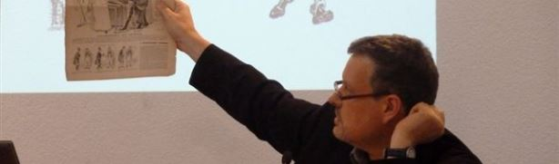

## How to Analyze Image-Texts

__Master Class & Lecture by Prof. Roger Sabin (Central St. Martins London)__

__Date:__ 14 April 2016, 10:00-17:00  
__Location:__ 10.00-13.00 University Library – Potgieterzaal / 13.00-17.00 University Library – Doelenzaal
Singel 425, Amsterdam  
__Master class open to:__ RMa students who are a member of a Dutch Graduate Research School (onderzoekschool). RMa students who are members of OSL will have first access. RMa Students will receive 1 EC for attending the full day and preparing an object of inquiry for the master class.
__Registration__: [Onderzoekschool Literatuurwetenschap's registration page](http://www.oslit.nl/events/how-to-analyze-image-texts/) 

To an increasing degree, the image has found its way back into literature. But where the inclusion of images in literary texts is still often seen as a liminal phenomenon, it has been the central challenge for researchers in the burgeoning field of comics studies for decades. The comic book medium, especially in its more recent rebranding as the “graphic novel”, challenges preconceived notions of the fringes of the literary in both the sense of what constitutes the textual and good taste. Rather than redrawing the boundaries between these media and genres, this master class aims to explore how concepts from both of these theoretical backgrounds can inform the ways in which we look at cultural objects in which text and image are combined. This course, then, is for students who are interested in analyzing comics, illustrations in literary texts, book covers, digital literature, and other ways in which image and text cohabitate cultural objects in the 20th and 21st century. Participating students will be required to present a research object that they find interesting and/or challenging in this context, which will then be discussed by Prof. Roger Sabin (Central St. Martins London) who is an expert in the fields of comics history and image-text interactions more broadly. Preceding the master class is a public lectures by Prof. Sabin, which participants must also attend.

__Public Lecture: “Comics versus Books”__

This lecture will survey the boundaries of the debate on “culture” sparked by comics entering the mainstream in the late 19th century, looking at why printed images were so distrusted, and why the binary between books (“improving”) and comics (“corroding”) proved so difficult to challenge. The talk will suggest that the debate marks the origin of modern formulations of “pop culture.” In exploring the ways in which comics were perceived by critics in the late Victorian period, with a focus on the UK (at the time the world-leading producer of comics), it is possible to highlight fears about negative effects on “moral and political” behaviour. This entailed commentary on comics that involved the kind of language we might associate with backlashes against them in the 20th century (“a plague,” “a fungus,” etc.). But, as this lecture will argue, it could also encompass a celebration of comics as the “authentic vernacular” —the beating heart of the country.

[Roger Sabin is Professor of Popular Culture at Central Saint Martins, University of the Arts London](http://www.arts.ac.uk/csm/people/teaching-staff/culture-and-enterprise/dr-roger-sabin/). His books include Adult Comics: An Introduction (Routledge), and Comics, Comix and Graphic Novels (Phaidon). He reviews graphic novels for the press and radio.

