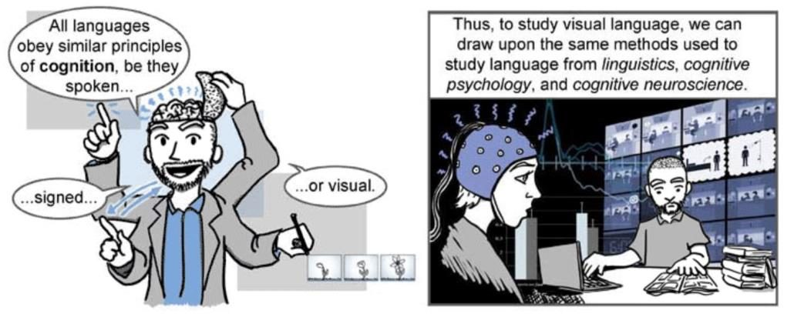

## The Visual Language of Comics

__Master Class and Lectures by Dr. Charles Forceville (UvA) and Dr. Neil Cohn (Tilburg)__

__Date:__ 2 June 2017, 10:00-15:00  
__Location:__ University Library – Potgieterzaal. Singel 425, Amsterdam.   
__Master class open to:__ PhD Candidates and RMa Students. 
__Credits__: 1 EC. 
__Coordination__: Amsterdam Comics, RMES, Dr. Erin La Cour and Rik Spanjers

Amsterdam Comics is pleased to announce the third installment of the Master Class and Guest Lecture series with “The Languages of Comics,” led by Dr. Charles Forceville and Dr. Neil Cohn. The workshop will engage students in the mechanics of visual language theory, and the practice thereof. The program consists of two lectures and a master class. The lectures will familiarize participants with the research of Dr. Charles Forceville and Dr. Neil Cohn. The master class will allow students to do some analyses themselves based on material provided by the lecturers.

#### _Program:_

__Registration: 10.00-10:15__

__Public Lecture 1: 10:15-11.15__ 


__Representation and metarepresentation of thoughts, speech, and sensory perception in comics
__. 
__Dr. Charles Forceville, University of Amsterdam__

Comics draw on the visual and the verbal modality, making it a thoroughly multimodal medium. A central strand of comics research is partly or wholly inspired by cognitive linguistics and relevance theory (e.g. Yus 2008, Kukkonen 2013, Cohn 2013, Forceville 2005, 2011, 2013, Forceville and Clark 2014).

As in monomodal written and spoken language, the representation of speech and thoughts in comics is a central issue. There are substantial differences between the following utterances:

* Lisa: The apple tree is to the right of the barn.
* Lisa: John says the apple tree is to the right of the barn.
* Lisa: John thinks the apple tree is to the right of the barn.

Utterances such as (2) and (3) show the speaker’s “’metarepresentational’ ability, i.e. the ability to represent the representations of others” (Clark 2013: 345). Here is another type of metarepresentation:

* Lisa: John sees/hears/smells/feels that the apple tree is to the right of the barn.

While the addressee of (1) can be fairly confident that, indeed, the apple tree is to the right of the barn this confidence diminishes in (2) and even further in (3) and (4), as in these utterances the responsibility for stating the correct location of the apple tree increasingly involves Lisa’s interpretation of John’s perspective on its location.

In the medium of comics this issue is further complicated because salient information about “saying/thinking/perceiving that …” can be conveyed verbally, visually, or in a combination of verbal and visual information. At the highest level, the comics reader will of course postulate an agency that is responsible (as “Lisa” is in [1]) for the information conveyed in the two modes – namely that of the creator of the comics, or that agency’s persona – what in classic narratology is called the “implied author.” That is, there is always a “narrating agency” that either ’says’ verbally and visually: “the apple tree is to the right of the barn” in its own voice, or does so by delegating this ‘saying’ to embedded narrators (often characters).

In this paper I will analyse panels from various comics sources to inventory which visual resources play a role in metarepresentations, and the degree to which these depend on interaction with the verbal mode. These resources include “point of view” shots and body postures as well as non-verbal information in characters’ text balloons. The findings will show that, and how, there are multimodal and purely visual equivalents for “thinking/perceiving that …” and even for “saying that …”

The broader interest of the paper is that considering “metarepresentations” in visual and multimodal modes helps expand our understanding of phenomena that have traditionally been seen as belonging exclusively to the domain of the verbal. This will benefit both the theorization of such discourses and help develop these hitherto mainly language-oriented models.

__Coffee break: 11.15-11.30
__

__Public Lecture 2: 11.30-12.30__

__The Visual Language of Comics__. 

__Dr. Neil Cohn, Tilburg University
__. 
[http://www.visuallanguagelab.com](http://www.visuallanguagelab.com)

Drawings and sequential images are an integral part of human expression dating back at least as far as cave paintings, and in contemporary society appear most prominently in comics. Just how is it that our brains understand this deeply rooted expressive system? I will present a provocative theory: that the structure and cognition of drawings and sequential images is similar to language.

Building on contemporary theories from linguistics and cognitive psychology, I will argue that comics are “written in” a visual language of sequential images that combines with text. Like spoken and signed languages, visual narratives use a systematic visual vocabulary, strategies for combining these patterns into meaningful units, and a hierarchic grammar governing coherent sequential images. We will explore how these basic structures work, what cross-cultural research shows us about diverse visual languages of the world, and what the newest neuroscience research reveals about the overlap of how the brain comprehends language, music, and visual narratives. Altogether, this work opens up a new line of research within the linguistic and cognitive sciences, raising intriguing questions about the connections between language and the diversity of humans’ expressive behaviors in the mind and brain.

__Lunch: 12.30-13.15__

__Masterclass: The Language of Comics: 13.15-15.00__

Preparation and readings:

* Forceville, Charles, Elisabeth El Refaie, and Gert Meesters (2014). “Stylistics and comics.” Chapter 30 in: Michael Burke (ed.), The Routledge Handbook of Stylistics (485-499). London: Routledge.
* Cohn, Neil. 2014. Building a better “comic theory”: Shortcomings of theoretical research on comics how to overcome them. Studies in Comics. 5(1), 57-75.
* Cohn, Neil. 2013. Navigating comics: An empirical and theoretical approach to strategies of reading comic page layouts. Frontiers in Cognitive Science. 4: 1-15
* Cohn, Neil. 2015. Narrative conjunction’s junction function: The interface of narrative grammar and semantics in sequential images. Journal of Pragmatics. 88:105-132

